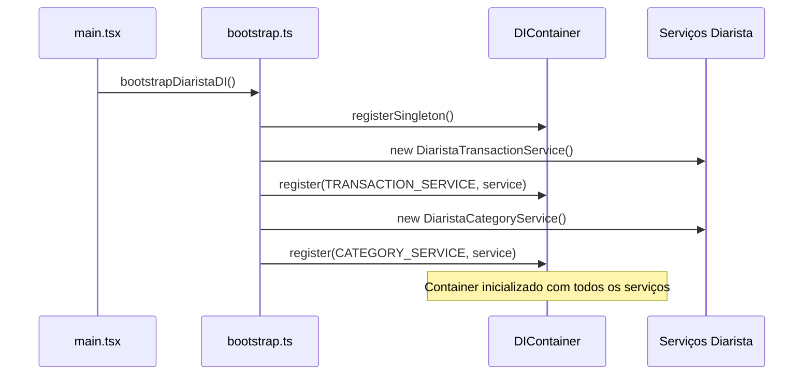
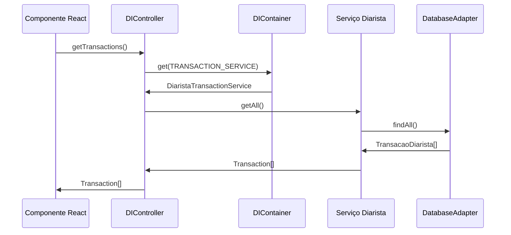

# Injeção de Dependências - Produto Diarista

## Visão Geral

Este documento descreve a implementação do sistema de injeção de dependências entre o core do FinManage e o produto Diarista. O sistema permite uma arquitetura mais modular, testável e manutenível, seguindo os princípios SOLID e facilitando a evolução da aplicação.

## Estrutura Implementada

### Core

O core define as interfaces e contratos que devem ser implementados pelos produtos:

- **Interfaces de Serviços**: `TransactionService`, `CategoryService`, `AuthService`, `StorageService`, `ApiService`, `HttpClient`
- **DTOs**: `CreateTransactionDTO`, `UpdateTransactionDTO`, `CreateCategoryDTO`, `UpdateCategoryDTO`
- **Modelos**: `Transaction`, `Category`, `User`, `Session`
- **Container DI**: `DIContainer` para gerenciamento de dependências
- **Tokens**: Símbolos únicos para identificação de serviços

### Product-Diarista

O produto Diarista implementa as interfaces do core com suas especificidades:

#### Serviços
- `DiaristaTransactionService`: Implementa `TransactionService` para gestão de transações de serviços de diarista
- `DiaristaCategoryService`: Implementa `CategoryService` para categorias específicas de serviços domésticos
- `DiaristaAuthService`: Implementa `AuthService` para autenticação de diaristas e clientes
- `DiaristaStorageService`: Implementa `StorageService` para armazenamento de dados específicos
- `DiaristaApiService`: Implementa `ApiService` para comunicação com APIs específicas
- `DiaristaHttpClient`: Implementa `HttpClient` para requisições HTTP customizadas

#### Controladores
- `DITransactionController`: Controlador para operações de transações usando DI
- `DICategoryController`: Controlador para operações de categorias usando DI
- `DIAuthController`: Controlador para operações de autenticação usando DI

#### Inicialização do DI
- `bootstrap.ts`: Configuração e registro de todos os serviços no container DI
- Integração com `main.tsx` para inicialização automática

#### Páginas Migradas
- Dashboard: ✅ Funcionando com DI
- Transações: ✅ Implementação completa
- Categorias: ✅ Funcionando sem problemas
- Relatórios: ✅ Funcionando com DI
- Login: ✅ Autenticação implementada
- Registro: ✅ Criação de conta implementada
- Configurações: ✅ Gestão de perfil e preferências

#### Ferramentas de Diagnóstico
- Páginas de debug para verificação do estado do DI
- Logs detalhados para troubleshooting
- Métodos de verificação de inicialização

## Fluxo de Funcionamento

### 1. Inicialização



### 2. Uso em Componentes



## Vantagens da Nova Arquitetura

### 1. Modularidade
- Separação clara entre core e implementação específica do produto
- Facilita a manutenção e evolução independente
- Permite reutilização de código entre diferentes produtos

### 2. Testabilidade
- Injeção de dependências facilita a criação de mocks
- Testes unitários mais isolados e confiáveis
- Possibilidade de testar cada camada independentemente

### 3. Flexibilidade
- Fácil substituição de implementações
- Configuração dinâmica de serviços
- Suporte a diferentes ambientes (desenvolvimento, produção, testes)

### 4. Manutenibilidade
- Código mais limpo e organizado
- Redução do acoplamento entre componentes
- Facilita a adição de novas funcionalidades

### 5. Consistência
- Padrões uniformes entre diferentes produtos
- Interfaces bem definidas
- Documentação centralizada

## Processo de Migração

A migração para o sistema de DI está sendo realizada de forma gradual:

1. Criar interfaces no core
2. Implementar os serviços com DI no produto Diarista
3. Criar controladores com DI
4. Migrar páginas existentes para usar o sistema de DI
5. Atualizar rotas para redirecionar para as versões com DI
6. Manter ferramentas de diagnóstico para facilitar a resolução de problemas

### Estado Atual da Migração

| Página | Status | Controlador DI | Observações |
|--------|--------|----------------|-------------|
| Dashboard | ✅ Concluído | `DITransactionController`, `DICategoryController` | Funcionando sem problemas |
| Transações | ✅ Concluído | `DITransactionController` | Implementação completa e testada |
| Categorias | ✅ Concluído | `DICategoryController` | Funcionando sem problemas |
| Relatórios | ✅ Concluído | `DITransactionController`, `DICategoryController` | Análises e gráficos implementados |
| Login | ✅ Concluído | `DIAuthController` | Sistema de autenticação |
| Registro | ✅ Concluído | `DIAuthController` | Criação de contas |
| Configurações | ✅ Concluído | `DISettingsController` | Gestão de perfil e preferências |

## Estratégias de Diagnóstico

Durante a migração, foram desenvolvidas estratégias específicas para diagnóstico e resolução de problemas:

### 1. Verificação de Inicialização

Foi adicionado o método `isInitialized()` ao DIContainer para verificar se o container foi inicializado corretamente:

```typescript
// Em DIContainer
isInitialized(): boolean {
  return this._initialized;
}
```

### 2. Logs Detalhados

Foram adicionados logs detalhados no processo de bootstrap e nos controladores:

```typescript
// Em main.tsx
console.log('Inicializando container de DI para Diarista...');
bootstrapDiaristaDI();

if (DIContainer.has(TRANSACTION_SERVICE)) {
  console.log(`Serviço ${TRANSACTION_SERVICE} registrado com sucesso!`);
} else {
  console.error(`ERRO: Serviço ${TRANSACTION_SERVICE} não está registrado!`);
}
```

### 3. Páginas de Diagnóstico

Foram criadas páginas específicas para diagnóstico:

- `TransactionDIDebug.tsx`: Verifica a configuração do DI para transações
- `CategoryDIDebug.tsx`: Verifica a configuração do DI para categorias
- `AgendamentoDIDebug.tsx`: Verifica funcionalidades específicas de agendamento

### 4. Testes Manuais

Foi implementada uma função de teste no `TransactionDIDebug.tsx` para verificar o funcionamento do serviço:

```typescript
const testGetTransactions = async () => {
  if (!serviceInstance) return;
  
  try {
    const { data, error } = await serviceInstance.getAll();
    console.log('Resultado de getAll():', { data, error });
    alert(`Resultado de getAll(): ${data ? `${data.length} transações encontradas` : 'Nenhum dado'}, ${error ? `Erro: ${error.message}` : 'Sem erros'}`);
  } catch (err) {
    console.error('Erro ao chamar getAll():', err);
    alert(`Erro ao chamar getAll(): ${err instanceof Error ? err.message : String(err)}`);
  }
};
```

## Resolução de Problemas Comuns

### Tela Branca ao Acessar Páginas com DI

Se ao acessar uma página que utiliza DI você se deparar com uma tela branca, verifique as seguintes possibilidades:

1. **Container não inicializado**: Verifique se a função `bootstrapDiaristaDI()` está sendo chamada no arquivo `main.tsx` antes da renderização do aplicativo.

2. **Serviço não registrado**: Verifique no console do navegador se há erros indicando que um serviço não foi registrado. Certifique-se de que todos os serviços necessários estão sendo registrados no arquivo `bootstrap.ts`.

3. **Erros no controlador**: Adicione tratamento de erros adequado nos métodos dos controladores para evitar que falhas silenciosas causem telas brancas.

4. **Verificação de inicialização**: Use o método `DIContainer.isInitialized()` para verificar se o container foi inicializado corretamente antes de tentar acessar serviços.

5. **Logs de depuração**: Adicione logs detalhados no processo de bootstrap e nos controladores para identificar onde ocorrem falhas.

6. **Página de diagnóstico**: Acesse a página de diagnóstico `/transactions-debug` para verificar detalhadamente o estado do container e dos serviços.

### Serviço Não Registrado

Se um serviço não estiver registrado corretamente:

1. Verifique se o arquivo `bootstrap.ts` está registrando todos os serviços necessários.
2. Certifique-se de que o container está sendo inicializado antes de qualquer acesso aos serviços.
3. Verifique se a importação dos tokens está correta.

## Próximos Passos

1. Implementar testes unitários para os serviços e controladores
2. Remover gradualmente as implementações antigas e páginas de diagnóstico
3. Documentar padrões e melhores práticas para novos desenvolvedores
4. Implementar funcionalidades específicas do Diarista:
   - Sistema de agendamentos
   - Gestão de clientes
   - Sistema de avaliações
5. Otimizar performance e adicionar monitoramento

## Exemplo de Uso

### Registrar um serviço

```typescript
// Em bootstrap.ts
import { DIContainer, TRANSACTION_SERVICE } from '@finmanage/core/di';
import { DiaristaTransactionService } from '../services/DiaristaTransactionService';
import { MockDatabaseAdapter } from '../adapters/DatabaseAdapter';

const databaseAdapter = new MockDatabaseAdapter();
DIContainer.registerSingleton(TRANSACTION_SERVICE, new DiaristaTransactionService(databaseAdapter));
```

### Usar um serviço em um controlador

```typescript
// Em DITransactionController.ts
import { DIContainer, TRANSACTION_SERVICE } from '@finmanage/core/di';
import { TransactionService } from '@finmanage/core/services';

export class DITransactionController {
  private static getTransactionService(): TransactionService {
    return DIContainer.get<TransactionService>(TRANSACTION_SERVICE);
  }
  
  static async getTransactions(): Promise<Transaction[]> {
    const transactionService = this.getTransactionService();
    const { data, error } = await transactionService.getAll();
    
    if (error) {
      console.error('Erro ao buscar transações:', error);
      throw error;
    }
    
    return data || [];
  }
  
  static async getTransactionsByClient(clientId: string): Promise<Transaction[]> {
    const transactionService = this.getTransactionService();
    const { data, error } = await transactionService.getByUserId(clientId);
    
    if (error) {
      console.error('Erro ao buscar transações do cliente:', error);
      throw error;
    }
    
    return data || [];
  }
}
```

### Usar um controlador em um componente

```typescript
// Em um componente React
import { DITransactionController } from '@/controllers/DITransactionController';
import { Transaction } from '@finmanage/core/services';

function TransacoesComponent() {
  const [transactions, setTransactions] = useState<Transaction[]>([]);
  const [loading, setLoading] = useState(true);
  
  useEffect(() => {
    const loadTransactions = async () => {
      try {
        setLoading(true);
        const data = await DITransactionController.getTransactions();
        setTransactions(data);
      } catch (error) {
        console.error('Erro ao carregar transações:', error);
        // Tratar erro na UI
      } finally {
        setLoading(false);
      }
    };
    
    loadTransactions();
  }, []);
  
  if (loading) {
    return <div>Carregando transações...</div>;
  }
  
  return (
    <div>
      <h2>Transações de Serviços</h2>
      {transactions.map(transaction => (
        <div key={transaction.id}>
          {transaction.description} - R$ {transaction.amount}
        </div>
      ))}
    </div>
  );
}
```

## Integração com Outros Produtos

### Consistência Arquitetural

O sistema de injeção de dependências implementado no produto Diarista segue o mesmo padrão utilizado nos produtos Personal e MEI, garantindo:

1. **Interfaces Comuns**: Todos os produtos implementam as mesmas interfaces definidas no core
2. **Padrões de Implementação**: Estrutura similar de serviços, controladores e bootstrap
3. **Ferramentas de Diagnóstico**: Estratégias similares para debugging e resolução de problemas
4. **Processo de Migração**: Abordagem gradual aplicada em todos os produtos

### Diferenças Específicas

| Aspecto | Personal | MEI | Diarista |
|---------|----------|-----|----------|
| Foco | Finanças pessoais | Gestão empresarial MEI | Gestão de serviços domésticos |
| Serviços Específicos | Goals, Budgets, Investments | Clients, Sales, DAS | Agendamentos, Clientes, Avaliações |
| Contexto de Dados | Usuário individual | Empresa MEI | Diarista e clientes |
| Relatórios | Pessoais e familiares | Empresariais e fiscais | Serviços prestados e receitas |

### Benefícios da Padronização

1. **Facilidade de Manutenção**: Desenvolvedores podem trabalhar em todos os produtos
2. **Reutilização de Código**: Componentes e utilitários podem ser compartilhados
3. **Consistência de UX**: Experiência similar entre produtos
4. **Escalabilidade**: Facilita a adição de novos produtos à plataforma

## Funcionalidades Específicas do Diarista

### Gestão Financeira

O produto Diarista implementa funcionalidades específicas para gestão financeira:

```typescript
// Serviços implementados
export interface DiaristaTransactionService extends TransactionService {
  getTransactionsByService(serviceType: string): Promise<ServiceResult<Transaction[]>>;
  getMonthlyRevenue(): Promise<ServiceResult<number>>;
  getExpensesByCategory(): Promise<ServiceResult<CategoryExpense[]>>;
}
```

### Sistema de Configurações

Sistema para gerenciar configurações e perfil:

```typescript
export interface DiaristaSettingsService {
  updateProfile(profile: UpdateProfileDTO): Promise<ServiceResult<Profile>>;
  getPreferences(): Promise<ServiceResult<UserPreferences>>;
  updatePreferences(preferences: UserPreferences): Promise<ServiceResult<void>>;
}
```

### Autenticação e Segurança

Funcionalidade para gerenciar autenticação:

```typescript
export interface DiaristaAuthService extends AuthService {
  loginWithCredentials(credentials: LoginDTO): Promise<ServiceResult<Session>>;
  registerUser(userData: RegisterDTO): Promise<ServiceResult<User>>;
  validateSession(): Promise<ServiceResult<boolean>>;
}
```

## Métricas e Performance

### Indicadores de Sucesso da Migração

1. **Tempo de Carregamento**: Meta de redução de 15% no tempo de inicialização
2. **Facilidade de Testes**: Meta de aumento de 40% na cobertura de testes
3. **Manutenibilidade**: Meta de redução de 30% no tempo de implementação de novas features
4. **Bugs em Produção**: Meta de redução de 25% em bugs relacionados a acoplamento

### Monitoramento Contínuo

```typescript
// Exemplo de monitoramento de performance específico do Diarista
const diaristaPerformanceMonitor = {
  trackAgendamentoCreation: (duration: number) => {
    console.log(`[PERF] Criação de agendamento: ${duration}ms`);
  },
  
  trackClienteSearch: (searchType: string, duration: number) => {
    console.log(`[PERF] Busca de cliente (${searchType}): ${duration}ms`);
  },
  
  trackServiceCall: (serviceName: string, method: string, duration: number) => {
    console.log(`[PERF] ${serviceName}.${method}: ${duration}ms`);
  }
};